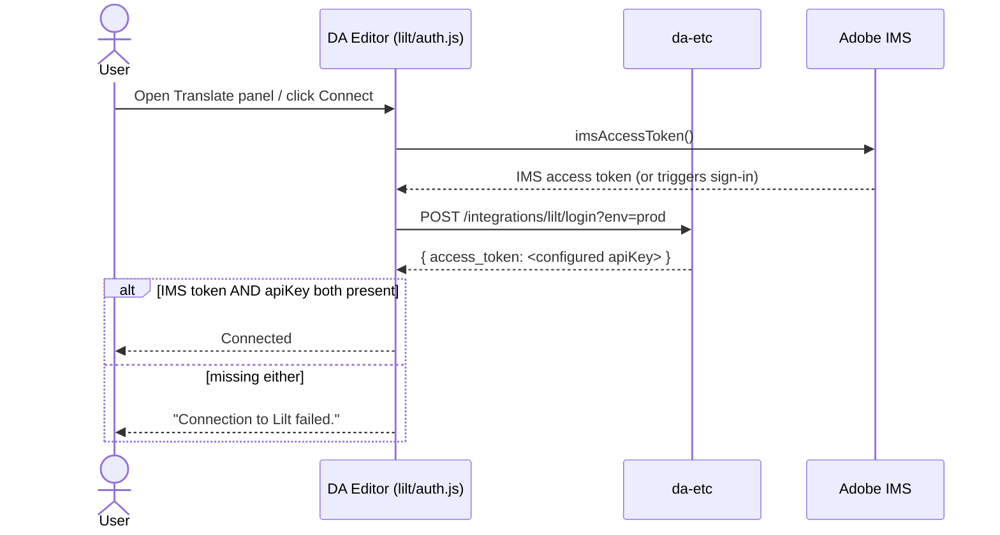
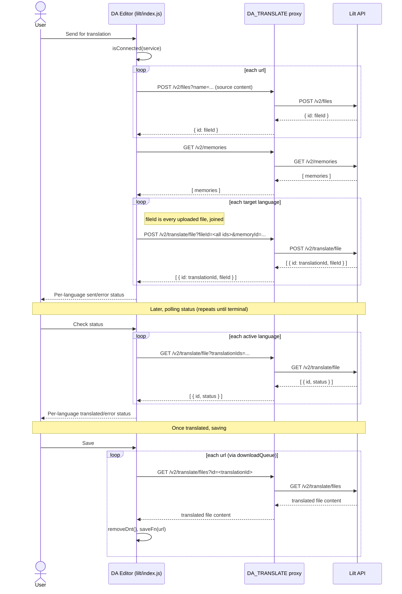
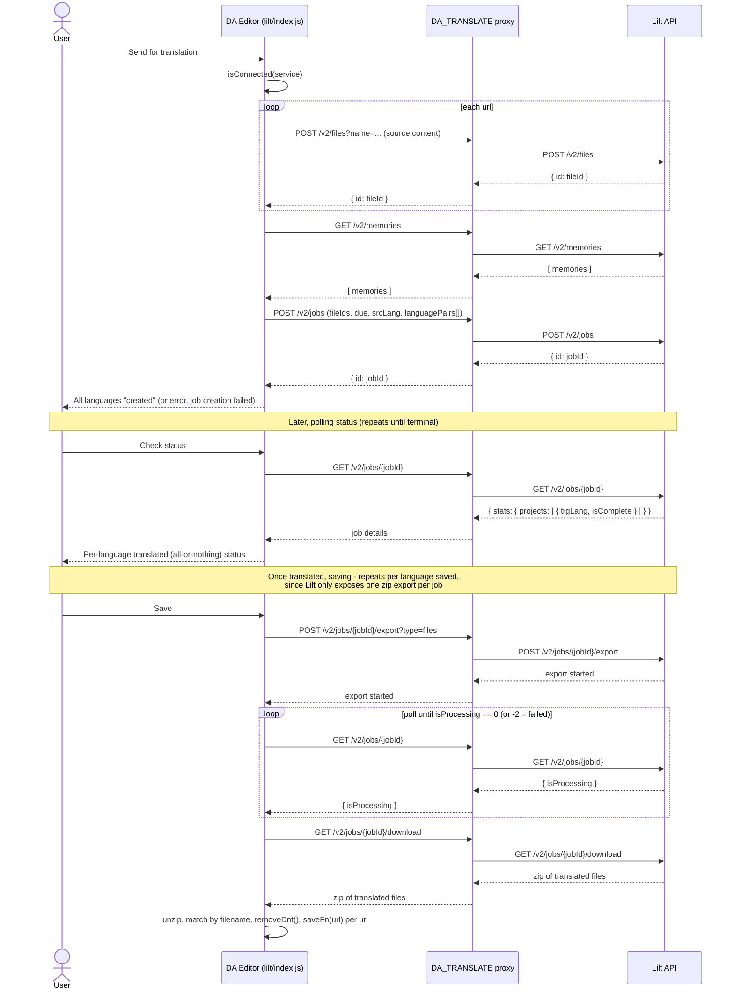

# Lilt Connector API Flows

Sequence diagrams for each user action in the Lilt translation connector
(`nx/blocks/loc/connectors/lilt/`), split by concern:

- **Connect** — shared by both translation modes.
- **AI Translation** — the default mode: one `/v2/translate/file` call per language,
  polled and downloaded per file.
- **Verified Translation** — a single job (`/v2/jobs`) covering every language, polled
  and downloaded once as a zip export.

`DA Editor` is the connector code running in the browser
(`nx/blocks/loc/connectors/lilt/{index,auth}.js`). `DA_TRANSLATE` is the proxy that
injects the org/site-scoped Lilt API key server-side; the browser never sees it
directly.

## Connect

Connecting never calls Lilt's real API: `da-etc`'s `lilt` integration has no OAuth
exchange, so its login endpoint just echoes back the configured API key as the
`access_token`. "Connected" only means an IMS session exists *and* da-etc has a key
configured for this org/site.

## AI Translation

## Verified Translation

