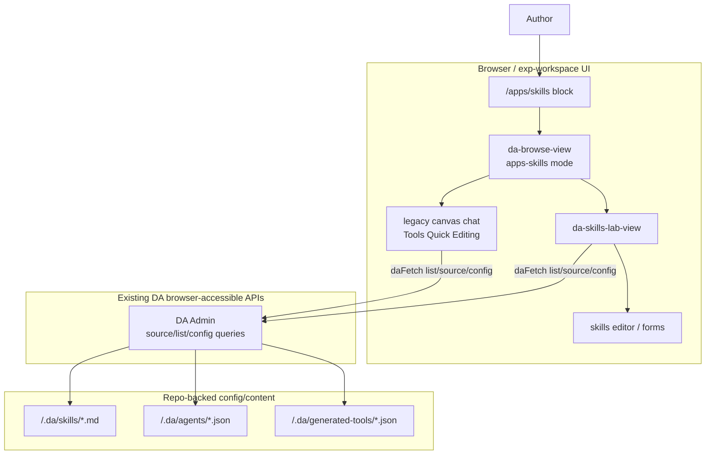
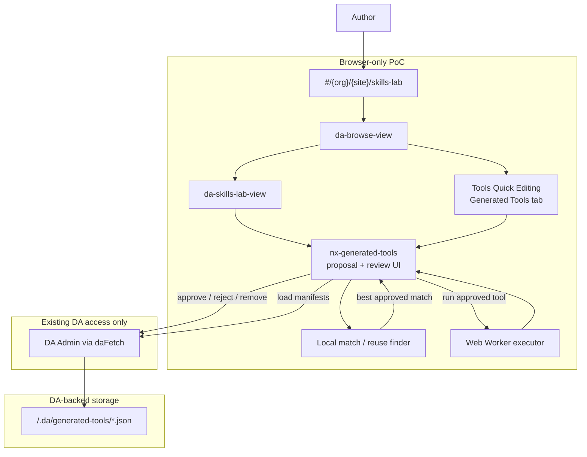
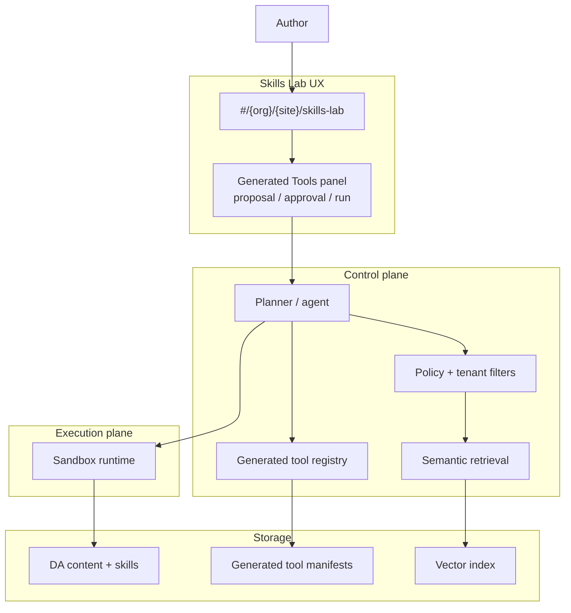

# POC Generated Tools Architecture

## Overview

This document captures the **current Skills Lab POC** on `exp-workspace` / `feat/skills-lab-exp`.

The goal of the POC is to show that DA Skills Lab can:

- surface **seeded generated-tool proposals**
- let the user **approve, reject, and remove** them
- persist approved definitions using **existing DA browser-accessible source writes**
- reuse approved tools via **local client-side matching**
- execute approved tools **entirely in the browser** in a **Web Worker**

This POC does **not** add:

- a new Cloudflare Worker backend
- server-side generated-tool execution
- a service worker execution model
- MongoDB, KV, Vectorize, or any new persistence dependency

## Current POC Branch Context

- **Target branch line:** `exp-workspace` / `feat/skills-lab-exp`
- **Primary shell:** `da-browse-view`
- **Skills Lab route:** `#/{org}/{site}/skills-lab`
- **Page block:** `/apps/skills`
- **Quick-edit surface:** chat modal “Tools Quick Editing” includes **Generated Tools**

This work intentionally stays on the current browse + legacy canvas chat stack and does **not** move toward `ew` / `nx2`.

## Current State

The branch already includes:

- a full-page Skills Lab host block
- `da-browse-view` support for `apps-skills`
- a `da-skills-lab-view`
- a Generated Tools panel in chat-side Tools Quick Editing
- DA browser read/write patterns through `daFetch`

### Current state on `exp-workspace`

## Browser-Only POC Architecture

The PoC keeps all generated-tool execution client-side.

- **Persistence:** generated tool definitions stored as small JSON files under `/.da/generated-tools/`
- **Retrieval:** local deterministic matching against approved tools using `name`, `description`, `tags`, and `examplePrompts`
- **Execution:** module **Web Worker** receives `{ toolId, args, implementation }` and returns structured results

### POC architecture

### What it could look like later

We are **not** building this now, but this is the clean next-step shape if the team later wants stronger retrieval and a managed execution plane while preserving the current Skills Lab UX.

## Demo Flows

### 1. Proposal review

1. Open `#/{org}/{site}/skills-lab`
2. The Generated Tools panel shows two seeded proposals:
   - `readability-score`
   - `validate-headings`
3. The user approves a proposal
4. The definition is saved through existing DA browser writes to `/.da/generated-tools/{id}.json`
5. On reload, the approved tool is loaded back from DA storage

### 2. Run an approved tool

1. Open an approved tool’s detail panel
2. Paste HTML into the “Try it” input
3. Click **Run**
4. The page sends `{ toolId, args, implementation }` to a module Web Worker
5. The worker executes the deterministic tool logic and returns JSON output
6. The result is rendered back in the panel

### 3. Reuse an existing tool

1. Enter a request such as “check heading structure for accessibility”
2. The finder ranks approved tools locally using metadata and example prompts
3. The best match is shown immediately
4. The user runs the matched tool against pasted HTML

## Why Web Worker, Not Service Worker

This POC uses a **Web Worker** because the feature is:

> “Run isolated code for this page interaction now.”

That matches Web Worker behavior well:

- direct request/response with the page
- isolated execution off the main thread
- simple runtime for local deterministic compute
- no dependency on network interception or app lifecycle

A **Service Worker** would be a poor fit for this POC because it is optimized for:

- fetch interception
- offline caching
- background sync
- app-wide lifecycle mediation

Those are useful for future platform work, but not for a first generated-tools execution demo.

## Limitations / Next Steps

### Current POC limits

- seeded proposals only
- deterministic local JS implementations only
- no live LLM-generated code
- no server-side sandbox
- no embeddings or vector retrieval
- no write-capable generated tools

### Future directions

- move from seeded proposals to agent-authored proposals
- add richer retrieval beyond local metadata matching
- add browser-side WASM or client-AI execution tiers
- introduce a dedicated execution plane later if server-side tools become necessary
- evaluate migration to `ew` / `feat/skills-lab-rew` when the team is ready
