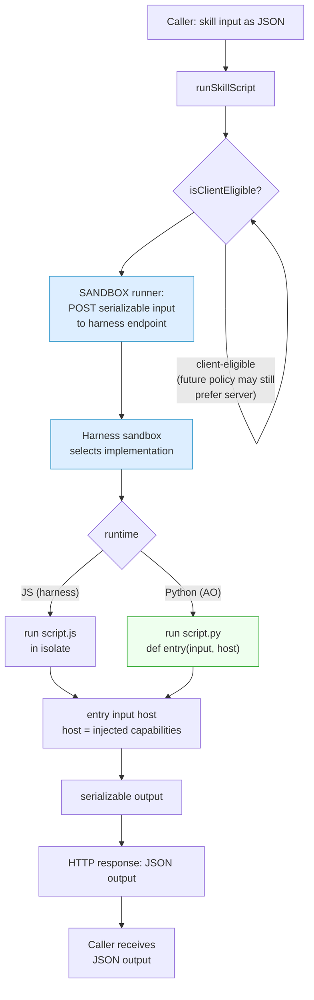
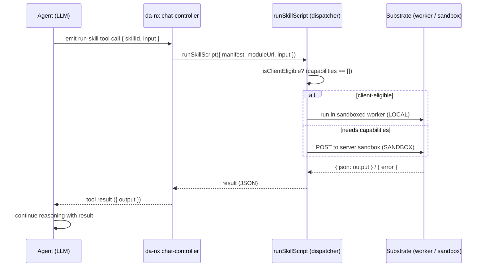

# Skill-Script Runtime

Status: proof of concept (Phase 1)
Owner: DA chat / skills platform

## 1. Intention

DA's product mandate is **"don't build agents, build skills."** Concretely that means
three things:

1. **Keep the agent runtime thin** so capability lives where it can be iterated
   *without an agent deploy*.
2. **Iterate without a deploy** — capability should be authorable and revisable as a
   skill, not hardcoded into the worker.
3. **Redistribution** — a capability authored once should be shareable across
   orgs/sites/teams as a self-contained unit, not locked to one deployment.

Today a skill is **pure Markdown** injected into the model's system prompt. It can
*instruct* the model to call existing tools, but it cannot *do* anything itself. Any
real capability (e.g. "extract text from this .docx") therefore has to be hardcoded
natively into `da-agent` — which is exactly the accretion the mandate warns against:
every new format or transform becomes an agent PR + deploy, and none of it is
redistributable.

The **skill-script runtime** closes that gap. It extends a skill so it can carry an
**executable script** with a declared, JSON-serializable I/O contract, and gives DA a
**client-side execution substrate** that runs that script in a sandboxed Web Worker
when it is provably safe to do so. The capability lives in the skill, iterates without
an agent deploy, and travels with the skill when redistributed.

The same script contract is designed up front to run **unchanged in three places** as
the platform matures:

- **Phase 1 (now):** browser Web Worker, fully client-side.
- **Phase 1.5:** the harness **server-side sandbox** when it ships.
- **Phase 2:** **AO's Python runtime** (see §6).

## 2. Design

### 2.1 The skill-script contract

A skill may carry one or more executable implementations behind a single,
language-neutral contract:

```
async <entry>(input, host) -> output
```

- `input` and `output` are **strictly JSON-serializable**. No live objects, DOM nodes,
  closures, or streams cross the boundary. This is the single property that makes a
  script location- and runtime-portable: serializable in / serializable out behaves
  identically whether the callee is a worker next door or a process across the wire.
- `host` is an **injected capability object**. A script never reaches for ambient
  globals; anything it is allowed to do is handed to it explicitly. A pure script
  receives only a buffered `log()`.

The JS implementation is `script.js`; a future AO implementation is `script.py` with
the mirrored signature `def <entry>(input, host) -> output`. **"Same skill" means same
contract, not necessarily same source** — the runtime selects the implementation for
its environment (decision: *contract + per-runtime implementations*).

### 2.2 Execution metadata

Authored skills declare an `execution` block in `skill.md` frontmatter; built-in
(in-repo) proof skills declare the equivalent as a plain manifest object:

```yaml
execution:
  entry: convert          # exported function name
  runtimes: [js]          # implementations present (js | py)
  capabilities: []        # [] => pure compute => client-eligible
  timeoutMs: 5000
  # input / output documented as JSON shapes
```

### 2.3 Client eligibility — enforce by construction

A skill declares the `capabilities` it needs. The rule is deliberately simple and
**structural, not trust-based** (decision: *declare + enforce by construction*):

- `capabilities: []` → **pure compute** → eligible to run **client-side** in a Web
  Worker.
- Any non-empty capability (`network`, `secrets`, `pii`, `storage`, …) → **not**
  client-eligible → routed to a server runtime.

Eligibility is enforced by *removing the capability*, not by trusting a declaration.
Before the worker loads a script it **neuters ambient globals** — `fetch`,
`XMLHttpRequest`, `WebSocket`, `importScripts`, `indexedDB`, `caches`,
`navigator.sendBeacon`, `Notification`. A "pure" script therefore *cannot* touch the
network, storage, or secrets even if it tried; the security/PII property holds by the
shape of the environment, not by review.

> Honesty note: a Web Worker is a strong-but-not-perfect boundary. Neutering ambient
> globals removes network/storage/PII exfiltration paths, which is the property we
> need for "safe to run fully client-side." A harder wall (sandboxed iframe + worker,
> or a WASM boundary) is a future hardening option if untrusted third-party skills are
> ever run client-side.

### 2.4 Location transparency

`runSkillScript({ manifest, moduleUrl, input })` is the single boundary every caller
uses. It checks eligibility and dispatches to a runner strategy:

- `LOCAL` (today) — spins the sandboxed Web Worker.
- `SANDBOX` (seam reserved) — POSTs the serializable `input` to the harness server
  sandbox.

Because the contract is async + serializable from day one, **callers do not change**
when a skill moves from `LOCAL` to `SANDBOX`. The only thing the switch changes is data
flow (see §5.3).

### 2.5 Invocation: who decides, who runs

Running a skill-script involves three distinct roles. Keeping them separate is what
preserves the thin-agent mandate:

1. **Read / distribute** — the agent loads script-carrying skills (from `.da/skills/`
   or a marketplace), parses the `execution` contract, and includes them in the skills
   index. Pure plumbing.
2. **Orchestrate / decide** — at runtime the **agent (LLM)** decides *when* a script
   should run and *what input* to pass. This is the agent's job; it is the brain that
   knows intent.
3. **Execute** — the code actually runs in the **swappable substrate** (client worker
   today, server sandbox / AO later). Never in the agent.

The agent therefore **orchestrates but does not execute**. It delegates execution to
the substrate over the *existing client-executed tool-call round-trip* — a
script-carrying skill is, mechanically, **a client-executed tool whose body is the
skill's script**. The agent emits a run request; da-nx runs it via `runSkillScript`;
the JSON result flows back to the agent, which continues reasoning.

There are **two triggers**:

- **Client-triggered (normalization)** — da-nx runs the script proactively on a client
  event (e.g. a `.docx` is attached). The agent only ever sees the result (markdown).
  No orchestration; the agent is not involved in the decision.
- **Agent-triggered** — the LLM decides mid-turn to run a skill (e.g. "extract tables
  from this data"). The agent orchestrates via the round-trip below.

Both triggers route through the same `runSkillScript` boundary, so the
client/server/AO execution choice is identical regardless of who pulled the trigger.

## 3. Proof of concept (Phase 1)

The PoC proves the **substrate**, with `docx-to-markdown` as the first skill riding on
it. The substrate, not docx, is the deliverable.

**Substrate** (`nx2/utils/skill-runtime/`):
- `capabilities.js` — capability constants + `isClientEligible(capabilities)`.
- `worker-host.js` — worker bootstrap; neuters ambient globals, imports the skill
  module, calls `entry(input, host)`, enforces `timeoutMs`, returns `{ json }` / `{ error }`.
- `runner.js` — `runSkillScript(...)`; eligibility gate + `LOCAL`/`SANDBOX` strategy seam.
- `index.js` — public surface.

**Proof skill** (`docx-to-markdown`): pure `convert(input, host)` over bundled `fflate`,
`capabilities: []`. Input `{ bytesBase64 }`, output `{ markdown }`.

**What the tests prove:**
- a pure script runs in the worker and returns serializable output;
- `fetch` (and the other network/storage globals) is `undefined` inside the worker —
  enforce-by-construction holds;
- a manifest with `capabilities: ['network']` returns `{ error: 'requires server runtime' }`
  **without** spinning a worker;
- a runaway script is killed at `timeoutMs`;
- the docx skill converts a fixture (`<w:t>hello world</w:t>` → markdown), unescapes
  XML entities, and returns `{ error }` on corrupt input without throwing past the runner.

**Explicitly out of scope this round:** wiring into the chat attachment flow (a
deliberate follow-up once the engine is proven), PDF (its current library is
environment-coupled and not cleanly client-portable), and authored-skill loading from
`.da/skills/` (the PoC ships docx as a built-in skill).

## 4. Phase 2 — AO Python runtime

AO has a Python runtime. The goal is to run **the same skill** there by supplying a
`script.py` that satisfies the identical contract:

```python
def convert(input, host):
    # input: {"bytesBase64": "..."}  ->  output: {"markdown": "..."}
    ...
    return {"markdown": text}
```

Nothing about the contract is JS-specific: JSON in, JSON out, capabilities declared the
same way, `host` injected the same way. The runtime selects `script.py` when running in
AO and `script.js` in the browser/harness. This is why the contract was fixed *before*
writing any implementation — Phase 2 is "add an implementation," not "redesign the
boundary."

## 5. Flow

### 5.1 Client-side (Phase 1, `LOCAL` runner)

```mermaid
flowchart TD
    A[Caller: skill input as JSON] --> B[runSkillScript]
    B --> C{isClientEligible?<br/>capabilities == []}
    C -- no --> E[return error:<br/>requires server runtime]
    C -- yes --> D[Spawn sandboxed Web Worker<br/>from blob URL]
    D --> F[Worker bootstrap:<br/>delete fetch / XHR / WebSocket /<br/>importScripts / indexedDB / caches]
    F --> G[Dynamic import script.js]
    G --> H["entry(input, host)<br/>host = { log }"]
    H --> I{within timeoutMs?}
    I -- no --> J[terminate worker<br/>return error]
    I -- yes --> K[postMessage<br/>json: output, logs]
    K --> L[Caller receives<br/>JSON output]

    style F fill:#fde,stroke:#c39
    style E fill:#fee,stroke:#c66
    style J fill:#fee,stroke:#c66
```

Key property: the **binary never leaves the browser**. The user-attached bytes are
already client-side; conversion is network-free, and only the small extracted result is
sent onward.

### 5.2 Server-side (Phase 1.5 / Phase 2, `SANDBOX` runner)



The caller-facing boundary (`runSkillScript` → JSON output) is identical to §5.1. Only
the runner strategy and the data path differ.

### 5.2.1 Agent-triggered orchestration round-trip

When the LLM decides mid-turn to run a skill-script, it reuses the existing
client-executed tool-call round-trip — the agent orchestrates, the substrate executes.



The agent never sees *where* the script ran — it only sent input and got JSON back.
That is the same property that lets the execution location swap (§2.4) without touching
the agent.

### 5.3 The one thing the switch is *not* free

Toggling `LOCAL` → `SANDBOX` is a no-op for **callers** but a real change in **data
flow**:

| | `LOCAL` (client) | `SANDBOX` (server) |
|---|---|---|
| Where bytes live | already in browser | must be shipped to the sandbox |
| Wire cost | small result only | full input payload |
| Network dependency | none | required |
| Capability ceiling | pure compute only | network/secrets/PII allowed |

So the default is `LOCAL` for pure skills; `SANDBOX` is reached for when a skill
genuinely needs capabilities a client cannot safely have.

## 6. Decisions on record

- **Runtime model:** one JSON-serializable I/O contract per skill, with per-runtime
  implementations (`script.js`, later `script.py`). Same contract, runtime picks the
  impl.
- **Client eligibility:** declare-and-enforce-by-construction. Empty capabilities =
  client-eligible; the worker grants zero ambient access and only injected
  capabilities.
- **Phase 1 scope:** prove the substrate in isolation with docx as the proof skill; no
  chat wiring, no PDF, no authored-skill loading yet.
