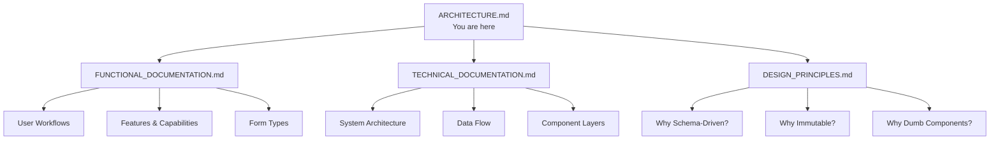
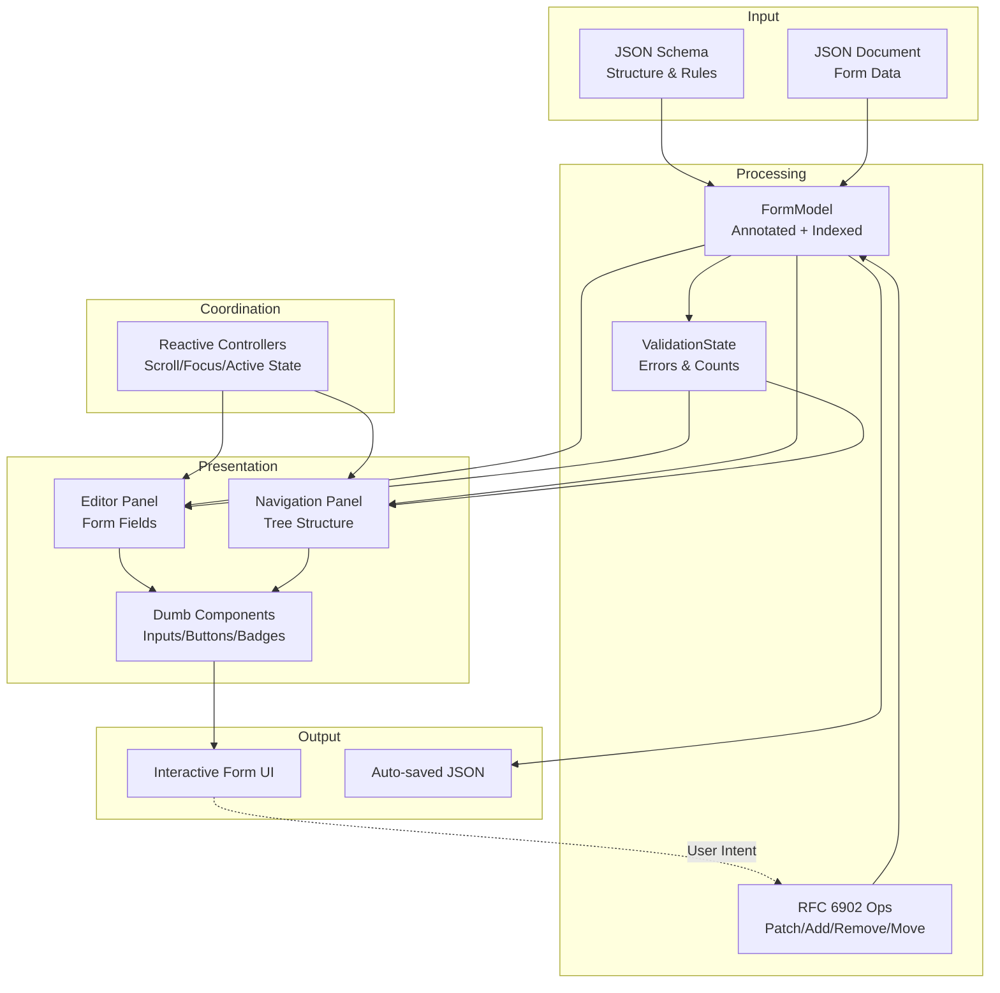
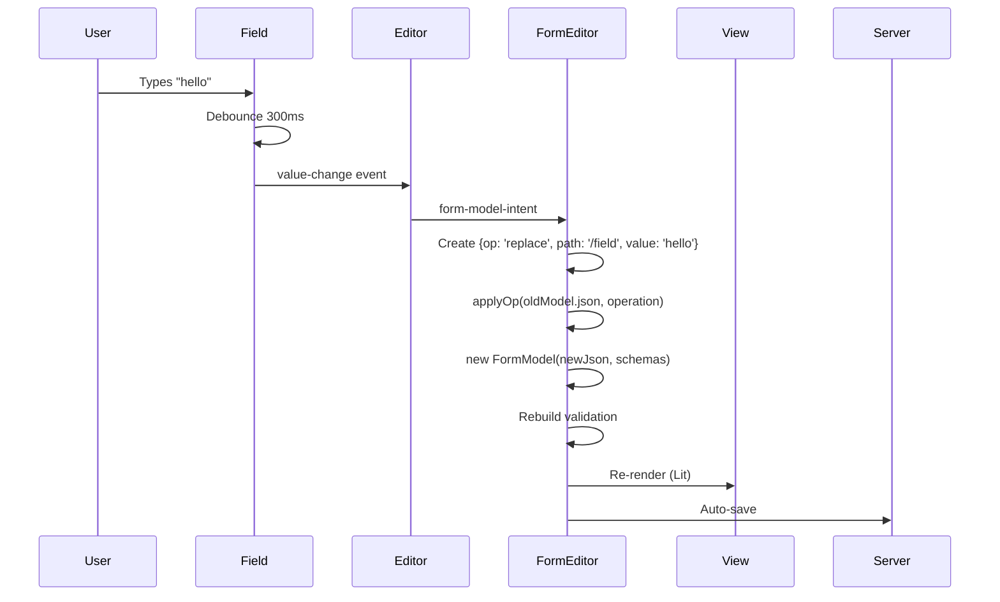
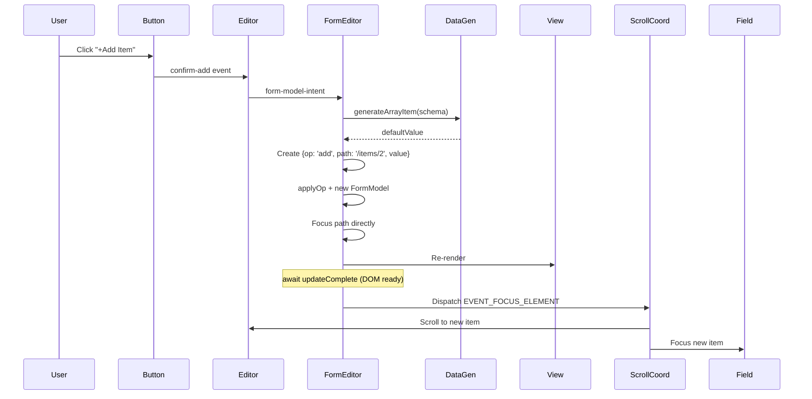
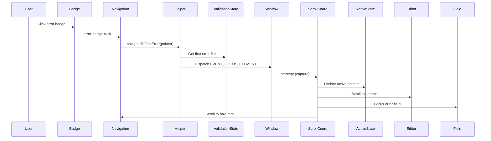
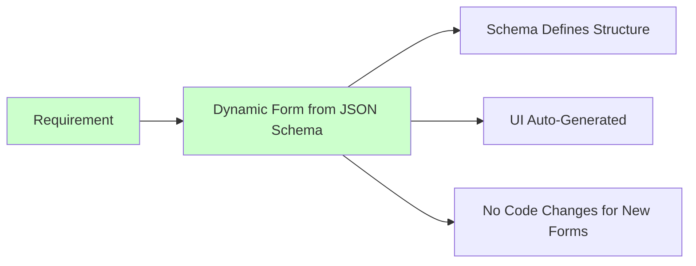

# Form Block - Architecture Documentation

## Overview

This directory contains comprehensive documentation for the Form Block architecture. The documentation is split into multiple focused documents to address different aspects and audiences.

## Documentation Structure



## Quick Reference

### For Product Managers / Stakeholders
👉 **Read**: [FUNCTIONAL_DOCUMENTATION.md](./FUNCTIONAL_DOCUMENTATION.md)

Understand:
- What the form block does
- User workflows and interactions
- Feature set and capabilities
- Performance characteristics

### For Developers (New to Codebase)
👉 **Read in order**:
1. [DESIGN_PRINCIPLES.md](./DESIGN_PRINCIPLES.md) - Understand the "why"
2. [TECHNICAL_DOCUMENTATION.md](./TECHNICAL_DOCUMENTATION.md) - Understand the "how"
3. [FUNCTIONAL_DOCUMENTATION.md](./FUNCTIONAL_DOCUMENTATION.md) - Understand the "what"

### For Reviewers (Evaluating Complexity)
👉 **Read**: [DESIGN_PRINCIPLES.md](./DESIGN_PRINCIPLES.md)

Specifically review:
- Trade-offs & Complexity Cost section
- Benefits of This Architecture section
- When to Deviate section

### For Maintainers (Making Changes)
👉 **Reference**: [TECHNICAL_DOCUMENTATION.md](./TECHNICAL_DOCUMENTATION.md)

Quick lookups:
- Component responsibility chart
- Data flow diagrams
- Utility function reference
- Testing strategy

## High-Level System Overview



## Core Architecture Principles

### 1. Schema-Driven 📋
**JSON Schema as single source of truth**

```
JSON Schema → FormModel → Automatic UI
```

- Structure defined by schema, not code
- Validation rules from schema constraints
- Field types derived from schema types
- New forms = new schema files (no code changes)

### 2. Immutable Data Model 🔒
**Every change creates a new model**

```
Old Model → Operation → New JSON → New Model
```

- No hidden mutations
- Predictable change detection
- O(1) lookups via pre-built indexes

### 3. Dumb View Components 🎨
**Views receive computed props, contain zero business logic**

```
Smart Container → Compute Props → Dumb Component → Render
```

- Testable in isolation
- Reusable anywhere
- Easy to debug
- Clear separation of concerns

## Key Design Patterns

| Pattern | Purpose | Implementation |
|---------|---------|----------------|
| **Unidirectional Data Flow** | Predictable updates | Intent → Operation → Model → View |
| **Pre-Computation Cache** | Performance | Compute all props once in `willUpdate()` |
| **Reactive Controllers** | Cross-cutting concerns | Lit controllers for scroll/focus/state |
| **RFC 6901 Pointers** | Uniform references | `/path/to/field` format throughout |
| **RFC 6902 Patches** | Standard operations | add/remove/replace/move operations |
| **Registry Pattern** | DOM references | Map pointers to elements for focus |
| **Event Coordination** | Panel synchronization | Coordinator intercepts and dispatches |

## System Metrics

### Codebase Size
- **Total**: Approximately 2,500-3,000 lines of code
  - Data Model
  - View Components (Smart + Dumb)
  - Controllers
  - Utilities
  - Validation

### Performance
- **Field Lookup**: O(1) via Map indexes
- **Rendering**: O(N) with pre-computation
- **Change Detection**: O(1) reference comparison

## Common Operations Flow

### Edit Field Value



### Add Array Item



### Navigate via Error Badge



## File Organization

```
blocks/form/
├── form.js                          # Main orchestrator
├── form.css                         # Main styles
├── constants.js                     # Event names, constants
│
├── data/
│   └── model.js                     # FormModel (immutable)
│
├── validation/
│   └── validation-state.js          # ValidationState (immutable)
│
├── controllers/                     # Reactive Controllers
│   ├── active-state-controller.js
│   ├── scroll-coordinator-controller.js
│   ├── element-registry-controller.js
│   └── scroll-target-controller.js
│
├── views/                           # Smart view components
│   ├── editor.js                    # Editor panel
│   ├── navigation.js                # Navigation panel
│   ├── preview.js                   # Preview panel (optional)
│   └── components/                  # Dumb components
│       ├── editor/
│       │   ├── generic-field/       # Universal field component
│       │   └── form-item-group/     # Group header component
│       ├── navigation/
│       │   ├── navigation-item/
│       │   ├── navigation-header/
│       │   └── breadcrumb-nav/
│       └── shared/                  # Reusable components
│           ├── action-menu/
│           ├── error-badge/
│           ├── add-item-button/
│           ├── insert-button/
│           ├── remove-button/
│           └── move-to-position-button/
│
└── utils/                           # Pure functions
    ├── schema.js                    # Schema loading & $ref resolution
    ├── rfc6901-pointer.js           # JSON Pointer operations
    ├── rfc6902-patch.js             # JSON Patch operations
    ├── pointer-utils.js             # Pointer helpers
    ├── validation-helper.js         # Validation queries
    ├── navigation-helper.js         # Navigation logic
    ├── navigation-tree-builder.js   # Tree construction
    ├── field-helper.js              # Field type detection
    ├── data-generator.js            # Default value generation
    ├── focus-helper.js              # Focus management
    ├── breadcrumb-helper.js         # Breadcrumb path
    └── persist.js                   # Save/load JSON
```

## Addressing Complexity Concerns

### Current Complexity

The form block consists of approximately 2,500-3,000 lines of code across:

1. **UI Coordination**
   - Scroll synchronization between panels
   - Focus management
   - Active state tracking

2. **State Management**
   - FormModel with immutable pattern
   - ValidationState
   - Pre-computation caching

3. **View Layer**
   - Dual-panel interface (editor + navigation)
   - Reusable components
   - Action menus

4. **Utilities**
   - Pure helper functions
   - RFC 6901/6902 implementations

### Why This Approach?



**Core Requirement**: The form must be dynamic and schema-driven. Given any valid JSON Schema, the form should automatically generate the appropriate UI.

**Current Reality**: This form block currently has zero customers. 

**Complexity Question**: The feedback indicates the current implementation is the 2nd most complex block in DA, which is "not acceptable for a block that has zero customers." The question is whether this complexity is inherent to the schema-driven requirement, or if the implementation could be simpler.

### Simplification Opportunities

See [DESIGN_PRINCIPLES.md](./DESIGN_PRINCIPLES.md) section "Trade-offs & Complexity Cost" for detailed analysis of what could be simplified and the trade-offs involved.

## FAQ

### Q: Why not just use a form library like Formik/React Hook Form?

**A**: Those libraries handle form state but don't provide:
- Schema-driven automatic UI generation
- Nested array management with constraints
- Dual-panel navigation
- JSON Schema validation integration
- RFC 6901/6902 standards support

### Q: Could this be simpler?

**A**: Yes, by removing features:
- Remove navigation panel: -600 lines
- Remove scroll sync: -500 lines
- Remove validation UI: -200 lines
- Remove array operations: -400 lines

Result: ~1,000 line basic form editor with manual JSON editing.

### Q: Why immutable model instead of observable/reactive state?

**A**: 
- ✅ Simpler mental model (create new vs track changes)
- ✅ Works perfectly with Lit's change detection
- ✅ No observer cleanup needed
- ✅ No hidden mutation bugs

### Q: What's the learning curve?

**For Maintenance**:
- Day 1: Read DESIGN_PRINCIPLES.md (30 min)
- Day 2: Read TECHNICAL_DOCUMENTATION.md (1 hour)
- Day 3: Make first change (2-4 hours)

**For New Features**:
- Week 1: Understand architecture
- Week 2: Add simple feature
- Week 3: Add complex feature

### Q: How does this compare to other DA blocks?

**Per feedback, this is the 2nd most complex block in DA.**

**Why higher complexity?**:
- Generic engine vs specific implementation
- Dual-panel coordination
- Array management with constraints
- Schema-driven generation
- Controller-based architecture

## Next Steps

### For Understanding
1. Read [DESIGN_PRINCIPLES.md](./DESIGN_PRINCIPLES.md)
2. Read [TECHNICAL_DOCUMENTATION.md](./TECHNICAL_DOCUMENTATION.md)
3. Read [FUNCTIONAL_DOCUMENTATION.md](./FUNCTIONAL_DOCUMENTATION.md)

### For Development
1. Review file organization above
2. Check component responsibility chart in TECHNICAL_DOCUMENTATION.md
3. Review design patterns section
4. Start with small change in utilities (pure functions)

### For Evaluation
1. Review "Trade-offs & Complexity Cost" in DESIGN_PRINCIPLES.md
2. Check "Simplification Opportunities" in TECHNICAL_DOCUMENTATION.md
3. Consider: Is generic engine worth the upfront complexity?

## Conclusion

The Form Block is a **schema-driven dynamic form editor**. 

**Core Requirement**: Given any JSON Schema, automatically generate and render the appropriate form UI

**Current State**: Zero customers

**Architecture Characteristics**:
- ✅ Schema-driven (meets core requirement)
- ✅ Well-structured with clear separation
- ✅ Documented with rationale
- ❌ High complexity (2nd most complex block in DA)
- ❌ Too complex for a block with zero customers (per feedback)

**The Complexity Question**: The original feedback states:
1. "All of the glue complexity to create the 'attractive' UI - It can either be done more simply, or it should be removed if it cannot be done more simply."
2. "All of the complexity for managing state and data - It can be done more simply."

This suggests the complexity is in the IMPLEMENTATION approach (how the UI is built, how state is managed), not in the schema-driven requirement itself.

**Potential Simplifications**: See TECHNICAL_DOCUMENTATION.md section "Simplification Opportunities" for specific areas that could be simplified while maintaining the schema-driven functionality.
