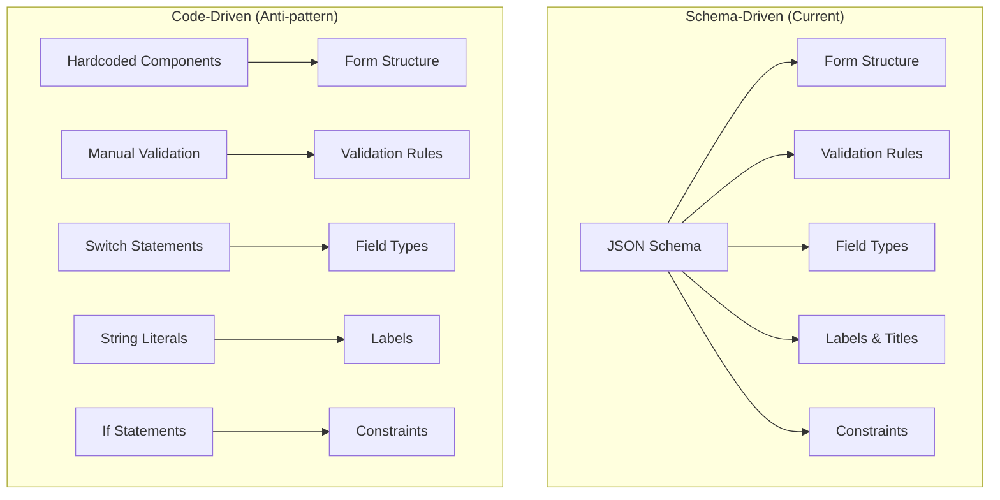
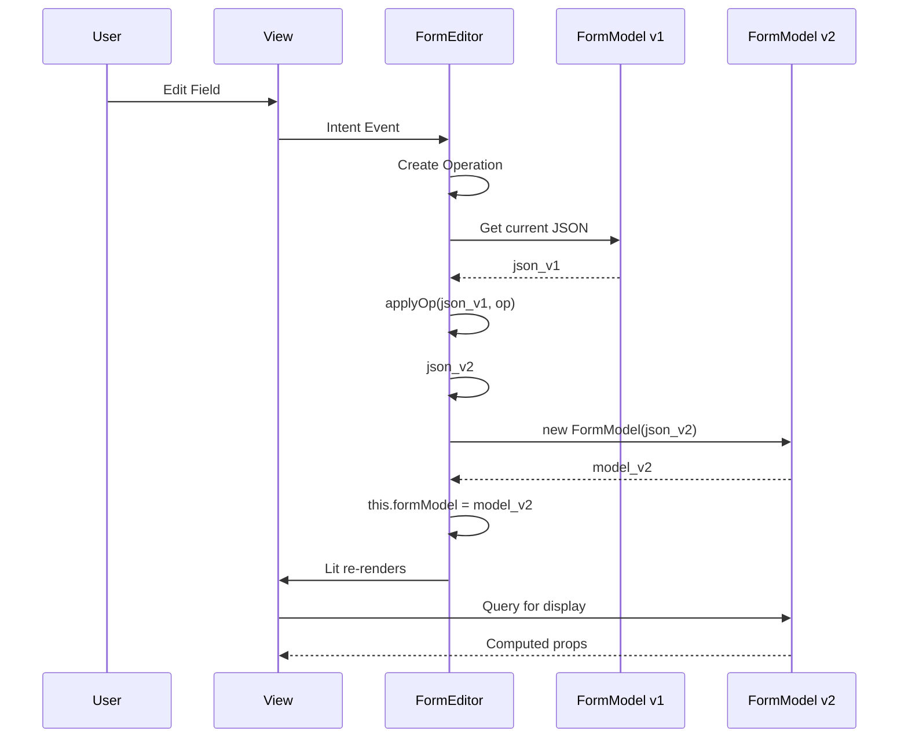
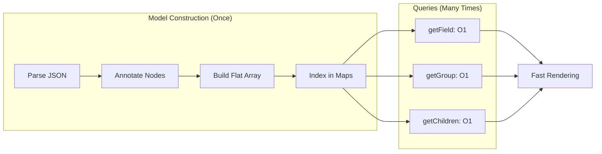
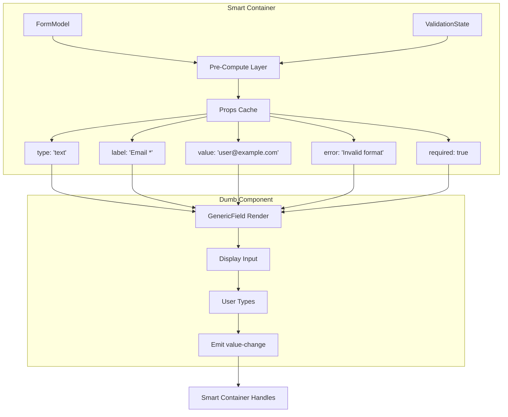
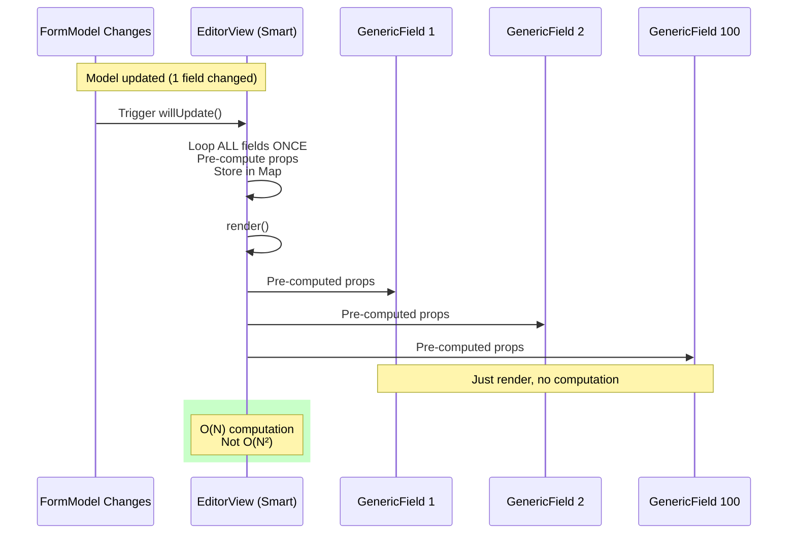
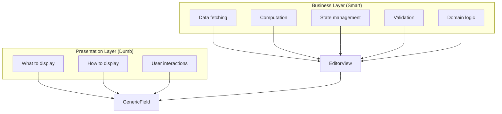
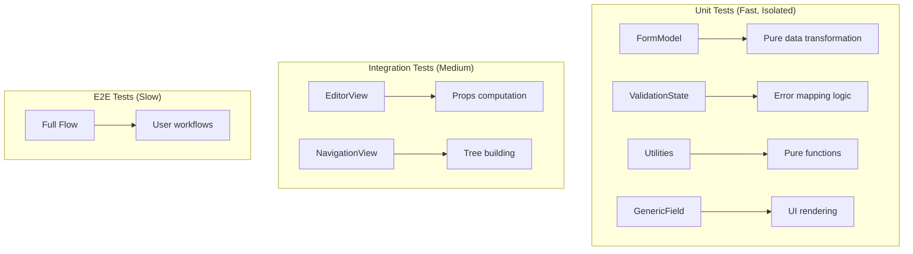
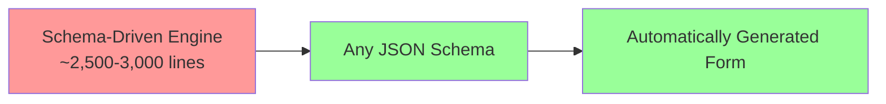

# Form Block - Design Principles & Rationale

## Core Design Philosophy

The Form Block architecture is built on three foundational principles that work together to create a maintainable, testable, and scalable system.

## 1. Schema-Driven Architecture

### Principle
**The JSON Schema is the single source of truth for form structure, validation, and behavior.**

### Why This Matters



### Benefits

1. **Maintainability**: Change schema file, not code
   - Add new fields: Update schema, form auto-generates
   - Change validation: Update schema constraints
   - Reorder fields: Change property order in schema

2. **Consistency**: Same schema for frontend forms and backend validation
   - No drift between client and server validation
   - API contracts directly from schema
   - Documentation auto-generated from schema

3. **Scalability**: Support unlimited form variations without code changes
   - Each form type = one schema file
   - No new components per form type
   - Reuse same form engine for all schemas

4. **Testability**: Test schema parsing once, not each form
   - Unit test: schema → model transformation
   - Not: custom logic per form

### Example Impact

**Before (Code-Driven)**:
- Need to write custom component for every form type
- Hardcode fields, validation, labels in component code
- Copy/paste patterns across forms

**After (Schema-Driven)**:
- One generic FormEditor component handles all forms
- Schema defines everything (structure, validation, labels)
- New form = new schema file, zero code changes

## 2. Data-Centric Immutable Model

### Principle
**All form state lives in an immutable data model. Every change creates a new model. Views query the model via pure functions.**

### Architecture Visualization

```mermaid
flowchart TD
    subgraph "Immutable Model Pattern"
        A[User Action] --> B[Create Operation]
        B --> C[applyOp oldModel, operation]
        C --> D[New JSON]
        D --> E[new FormModel newJSON]
        E --> F[Store in State]
        F --> G[Lit Detects Change]
        G --> H[Re-render Views]
    end
    
    subgraph "Mutable Pattern (Anti-pattern)"
        A2[User Action] --> B2[model.updateField]
        B2 --> C2[Mutate Internal State]
        C2 --> D2[Hope UI Updates]
        D2 --> E2[Manual Re-render]
    end
```



### Why Immutability?

1. **Predictability**: No hidden mutations
   - Creating new object makes data changes explicit
   - Mutable approach: unclear if/when data changed
   
2. **Change Detection**: Lit automatically detects changes
   - Lit compares object references
   - Reference changed = re-render triggered

3. **Race Condition Prevention**: No async mutation issues
   - Each operation works on immutable snapshot
   - Mutable approach: async operations can interfere with each other

### Data Flow Diagram



### Pre-Indexed Lookups

**Why O(1) Matters**:

For a form with 100 fields:
- **O(N) search**: 100 lookups = 10,000 operations per render
- **O(1) Map**: 100 lookups = 100 operations per render
- **100x faster** for large forms



## 3. Dumb View Components

### Principle
**View components receive all computed data via props and have zero business logic. All computation happens in smart containers before rendering.**

### Smart vs Dumb Architecture



### Why Dumb Components?

#### 1. Testability

**Dumb Component Test** (Easy):
- Test in complete isolation
- Pass simple props (type, label, value, error, required)
- Assert on rendered output
- No mocks needed!

**Smart Component Test** (Hard):
- Needs FormModel, ValidationState, Schema
- Must load schema files
- Create model, run validation
- Complex setup and assertions

#### 2. Reusability

**Dumb Component**: Reusable anywhere
- Can use in ANY context (form editor, dialogs, settings, other apps)
- Just pass props (type, label, value, onChange)
- No dependencies on form system

**Smart Component**: Coupled to form system
- Only works with FormModel
- Requires pointer and model props
- Can't use outside form context

#### 3. Performance (Pre-Computation)



**Without Pre-Computation** (Anti-pattern):
- Each field computes props independently on every render
- For 100 fields: 100 calls to getFieldError, determineFieldType, etc.
- Wasted computation when only 1 field changed

**With Pre-Computation** (Current):
- Container computes ONCE for all fields in `willUpdate()`
- ONE loop through all fields, build Map of pre-computed props
- Render phase: O(1) Map lookups only
- No repeated computation

#### 4. Separation of Concerns



**Clear Boundaries**:
- **Dumb**: "I display text, numbers, and checkboxes"
- **Smart**: "I know about schemas, validation, and form models"

#### 5. Debugging & Maintenance

**Dumb Component Bug**:
```
User: "Checkbox doesn't show error message"

Developer:
1. Open GenericField
2. Look at renderCheckbox()
3. Find: Missing error display
4. Fix in ONE place
5. Done

Time: 5 minutes
```

**Smart Component Bug**:
```
User: "Checkbox doesn't show error message"

Developer:
1. Which component renders checkboxes?
2. How does it get validation state?
3. Trace through FormModel -> ValidationState -> SmartField
4. Is error in model? In state? In component?
5. Debug multiple layers
6. Find issue in validation mapping
7. Fix affects all field types
8. Test all field types

Time: 45 minutes
```

### Dumb Component Contract

A component is **dumb** if it:

✅ **Receives all data via props**
- Uses ONLY props passed in
- No fetching, no external state access

✅ **Has no knowledge of domain models**
- Bad: Knows about FormModel, calls methods on it
- Good: Generic types only (id, value, onChange)

✅ **Emits generic events**
- Good: Generic events like 'value-change' with id and value
- Bad: Domain-specific events with operations or model updates

✅ **Can be tested without mocks**
- No need to mock FormModel, ValidationState, etc.
- Just pass props and assert output

✅ **Reusable outside the form system**
- Works in any context
- No coupling to form-specific infrastructure

## Benefits of This Architecture

### Maintainability

| Task | Traditional Approach | This Architecture |
|------|---------------------|-------------------|
| Add new field type | Modify 5+ components | Update schema, add type detection |
| Change validation | Update validation, UI, error display | Update schema constraints |
| Fix rendering bug | Search through business logic | Isolated in dumb component |
| Add new form | Copy/paste form components | Create schema file |

### Testability



### Scalability

**Current**: 1000 lines of form-specific code + generic engine  
**Traditional**: 1000 lines per form × N forms

### Performance

- O(1) lookups for 1000+ fields
- Pre-computed props (O(N) not O(N²))
- Efficient change detection (immutable model)
- Minimal re-renders (Lit + precise dependencies)

## Trade-offs & Complexity Cost

### What Adds Complexity?

1. **Coordination Layer**: Controllers for scroll, focus, active state
   - **Why**: Two panels must stay synchronized
   - **Cost**: 500 lines of controller code
   - **Benefit**: Smooth UX, no panel drift

2. **Pre-Computation**: Props cache in willUpdate()
   - **Why**: Avoid O(N²) computation
   - **Cost**: Cache management logic
   - **Benefit**: 100x faster for large forms

3. **Immutable Model**: New model on every change
   - **Why**: Predictable state, change detection
   - **Cost**: Object creation overhead
   - **Benefit**: No mutation bugs, predictable updates

4. **Event Coordination**: ScrollCoordinator intercepts events
   - **Why**: Prevent scroll loops between panels
   - **Cost**: Event architecture complexity
   - **Benefit**: Deterministic scroll behavior

### Complexity Budget

**Estimated Total**: Approximately 2,500-3,000 lines for entire form system

**Core Requirement**: Dynamic form editor that can render any JSON Schema
- Schema defines structure, validation, field types, labels
- Form UI is automatically generated from schema
- New schemas = new forms, without code changes

**Current Status**: Zero customers

**Complexity Question**: Is the current implementation overly complex for meeting the schema-driven requirement? The original feedback suggests the implementation could be simpler while still meeting the core requirement.

## When to Deviate from These Principles?

### Schema-Driven

**Deviate when**:
- Form has highly dynamic behavior (fields appear/disappear based on complex logic)
- Schema would become more complex than code
- One-off form with no reuse value

### Immutable Model

**Deviate when**:
- Performance profiling shows model creation is a bottleneck
- Form has 10,000+ fields (rare)
- Specific optimization needed for real-time collaboration

### Dumb Components

**Deviate when**:
- Component has unique logic that doesn't fit the pattern
- Performance requires component-level caching
- Component is truly one-off and won't be reused

## Conclusion

These three principles work together:

1. **Schema-Driven**: Data structure defines everything
2. **Immutable Model**: Predictable state management
3. **Dumb Components**: Testable, reusable presentation

Result: A complex-looking system that is actually **simpler to maintain** than traditional per-form code.

The complexity is **concentrated** in the schema-driven engine.



**Key Insight**: The engine must handle any valid JSON Schema. The question is whether the CURRENT implementation could meet this requirement more simply.

**Complexity Trade-off**: 
- ✅ Required: Schema-driven dynamic form generation
- ❓ Question: Is the current implementation complexity necessary, or could it be simpler?
- The original feedback suggests much of the "glue complexity" and "state management complexity" could be done more simply.
