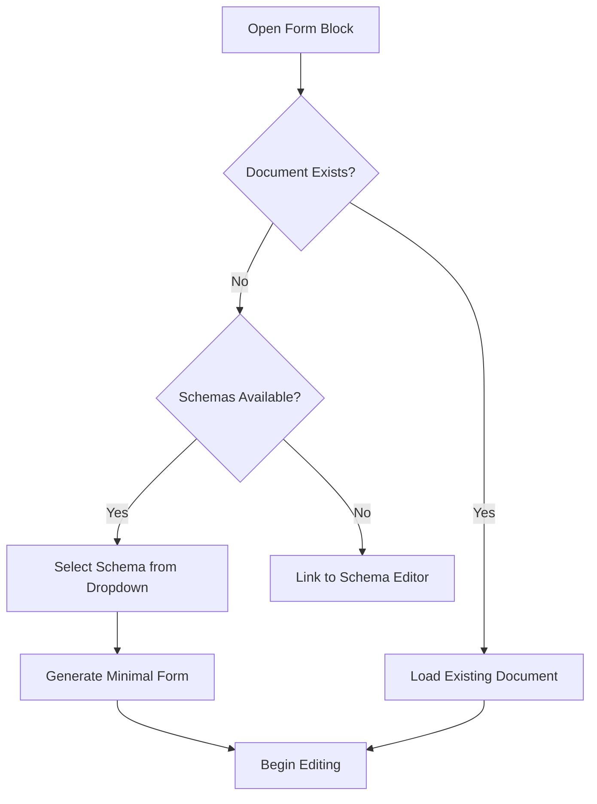
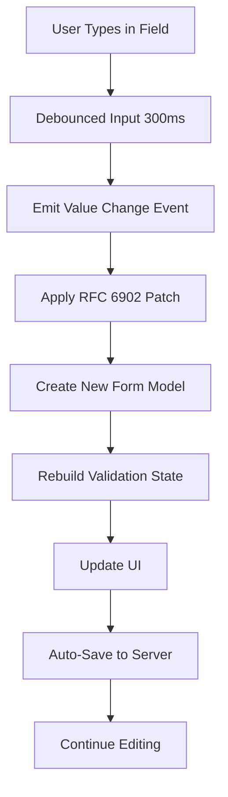
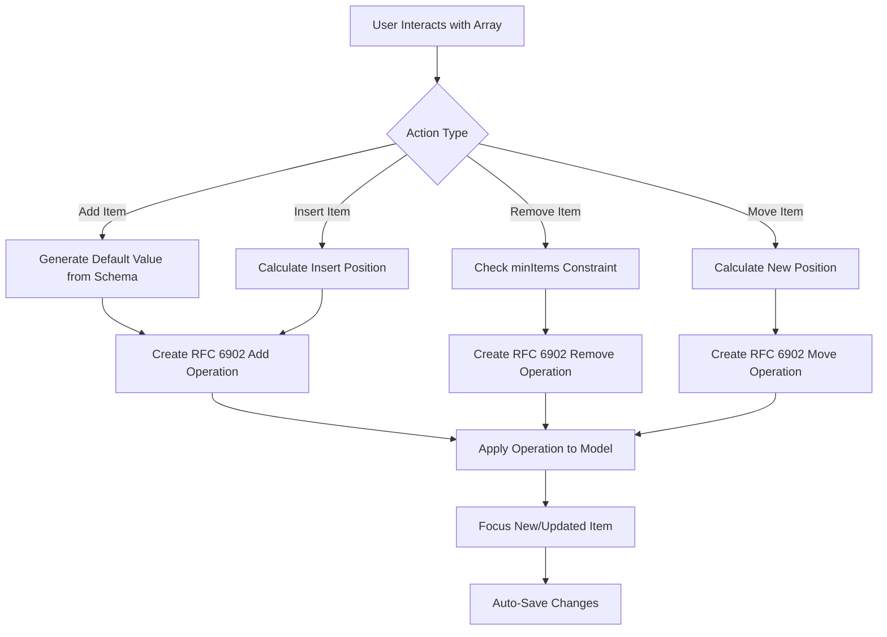
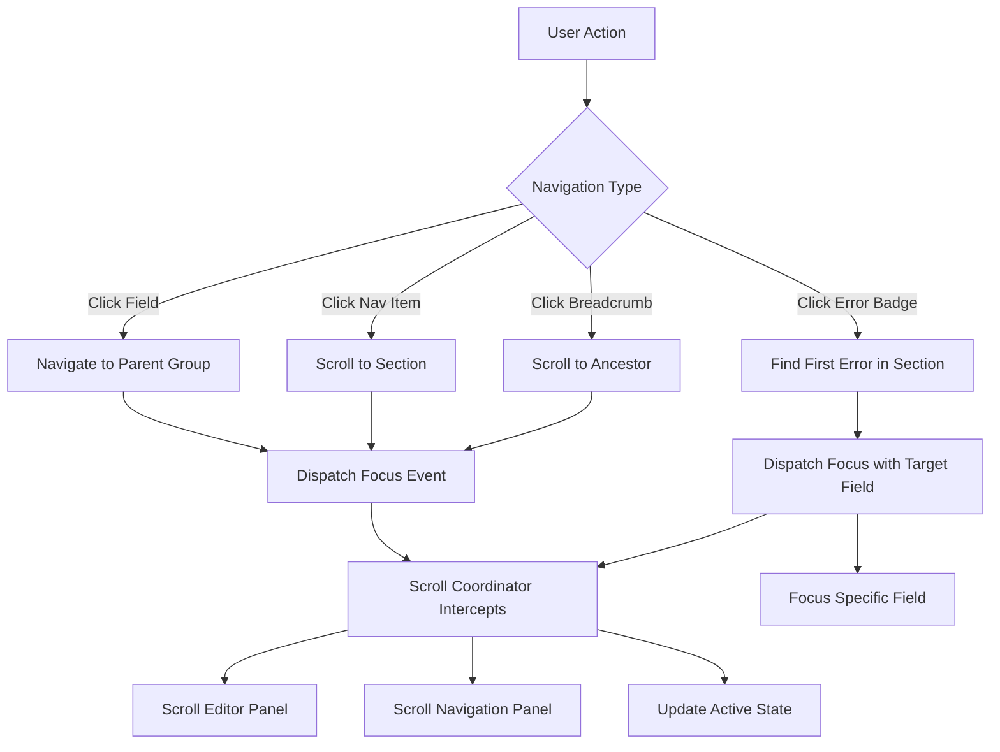

# Form Block - Functional Documentation

## Overview

The Form Block is a **schema-driven, JSON-based form editor** that enables users to create and edit structured data through an intuitive UI. 

**Core Requirement**: Given any JSON Schema, the block automatically generates the appropriate form interface, handles validation, and persists changes to structured JSON documents. The form is dynamic - different schemas produce different forms without code changes.

## Key Capabilities

### 1. Schema-Driven Form Generation
- Automatically generates form UI from JSON Schema definitions
- Supports complex nested objects and arrays
- Handles JSON Schema constraints (required fields, min/max items, enums, patterns)
- Schema definitions stored centrally and referenced by documents

### 2. Real-Time Editing Experience
- **Dual-panel interface**: Editor (left) and Navigation (right)
- **Live validation**: Errors displayed immediately as users type
- **Auto-save**: Changes automatically persisted with debouncing
- **Breadcrumb navigation**: Shows current location in nested structures
- **Visual error badges**: Error counts displayed throughout the UI

### 3. Array Management
- Add, remove, insert, and reorder array items
- Visual indicators for array item positions (#1, #2, etc.)
- Constraints enforcement (minItems, maxItems)
- Two array types supported:
  - **Complex arrays**: Objects/nested structures with full UI
  - **Primitive arrays**: Simple values (strings, numbers) with compact UI

### 4. Navigation & Focus Management
- Click any section in the editor to navigate
- Click navigation items to scroll to sections
- Click error badges to jump to first error
- Breadcrumb shows current context
- Active section highlighted in both panels

## User Workflows

### Starting a New Document

### Editing Form Data

### Array Item Management

### Navigation & Error Handling

## Form Types & Features

### Primitive Fields
| Field Type | JSON Schema Type | UI Component | Features |
|------------|-----------------|--------------|----------|
| Text | `string` | Text Input | Debounced, validation, required |
| Long Text | `string` (semantic) | Textarea | Multi-line |
| Number | `number`, `integer` | Number Input | Min/max, step validation |
| Boolean | `boolean` | Checkbox | True/false toggle |
| Enum | `string` with `enum` | Dropdown | Predefined options |

### Complex Structures
- **Objects**: Grouped fields with headers
- **Arrays**: Repeatable items with add/remove/reorder controls
- **Nested Structures**: Deep nesting supported

### Validation Features
- **Required fields**: Marked with asterisk (*)
- **Pattern validation**: Regex patterns for string fields
- **Range validation**: Min/max for numbers, minLength/maxLength for strings
- **Enum validation**: Restricted to predefined values
- **Array constraints**: minItems, maxItems enforced
- **Error messages**: Derived from JSON Schema validation

## Preview Mode

When enabled via `?showPreview=true`, displays a live preview panel showing the JSON document being edited. Useful for debugging and understanding the data structure.

## Accessibility

The form block includes basic accessibility features:

**Implemented:**
- ✅ ARIA attributes on form inputs (`aria-invalid`, `aria-required`)
- ✅ ARIA labels on buttons and interactive elements
- ✅ ARIA expanded states on dropdown menus
- ✅ Decorative icons hidden from screen readers (`aria-hidden="true"`)
- ✅ Tab order follows DOM structure
- ✅ Focus management: Automatic focus after actions (add, insert, move)
- ✅ Semantic HTML structure

**Not Yet Implemented:**
- ⚠️ Comprehensive keyboard navigation (arrow keys, Escape to close, etc.)
- ⚠️ ARIA live regions for dynamic validation updates
- ⚠️ Full screen reader announcements for state changes
- ⚠️ Keyboard shortcuts for common actions

## Performance Characteristics

- **Efficient lookups**: O(1) field and group lookups via Map indexes
- **Minimal re-renders**: Immutable model pattern with precise change detection
- **Debounced input**: User typing debounced at 300ms before updates
- **Debounced saves**: Network requests batched to reduce server load
- **Memory efficient**: Shared node references, no data duplication
- **Active state tracking**: Changes only on explicit user actions (clicks, adding items)

**Note**: All form items are rendered at once (no virtual scrolling).

## Limitations & Constraints

1. **Schema Complexity**: Some advanced JSON Schema features not yet supported:
   - `oneOf` discriminated unions in array items
   - `$dynamicRef` and `$dynamicAnchor`
   - Recursive schema references beyond depth limit

2. **Browser Support**: Requires modern browsers with:
   - ES2020+ features
   - Web Components v1

3. **Rendering**: All form items are rendered at once (no virtual scrolling or lazy loading).

4. **Accessibility**: Basic ARIA support implemented. Full keyboard navigation and screen reader optimization not yet complete.

## Future Enhancements (Not Implemented)

- **Virtual scrolling**: Lazy rendering for forms with 1000+ fields
- **Enhanced accessibility**: Full keyboard navigation, ARIA live regions, screen reader optimization
- **Conditional fields**: Show/hide fields based on other field values
- **Field dependencies**: Validate field based on other field values  
- **Custom field types**: Plugin system for domain-specific inputs
- **Undo/redo**: Action history with keyboard shortcuts
- **Offline support**: Local storage with sync on reconnect
- **Collaborative editing**: Real-time multi-user support
