# Form Block - Technical Documentation

## Architecture Overview

The Form Block follows a **unidirectional data flow** architecture with clear separation of concerns. The system is built around three core principles:

1. **Schema-Driven**: JSON Schema as the single source of truth for form structure
2. **Data-Centric**: Immutable data model with explicit operations
3. **View-Dumb**: Presentation components receive computed props, no business logic

## High-Level Architecture

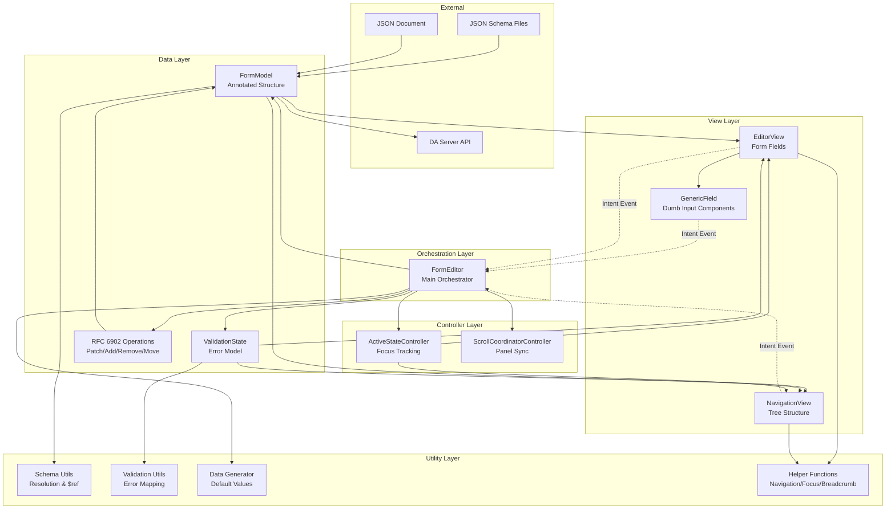

## Separation of Concerns

### 1. Orchestration Layer (Main Entry Point)

**Component**: `form.js` - `FormEditor` Web Component

**Responsibilities**:
- Load schema and document from server
- Instantiate and manage FormModel
- Coordinate validation state
- Handle user intents (value changes, array operations)
- Apply RFC 6902 operations to data
- Save changes to server
- Initialize controllers (scroll coordination, active state)

**Key Point**: This is the ONLY component that holds mutable state and creates new models.

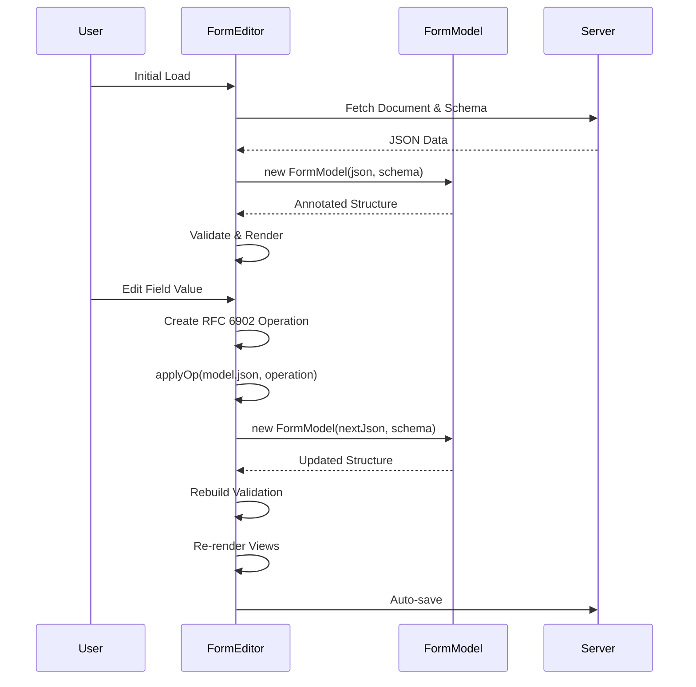

### 2. Data Layer (Immutable Models)

**Component**: `data/model.js` - `FormModel` Class

**Responsibilities**:
- Parse JSON document into annotated node structure
- Build O(1) lookup indexes (primitiveNodes, groupNodes)
- Resolve JSON Schema $ref references
- Calculate derived properties (canAddMore, isRequired, etc.)
- Provide query methods (getNode, getField, getGroup, getChildren)
- Run JSON Schema validation

**Key Point**: Immutable! Every change creates a NEW FormModel instance.

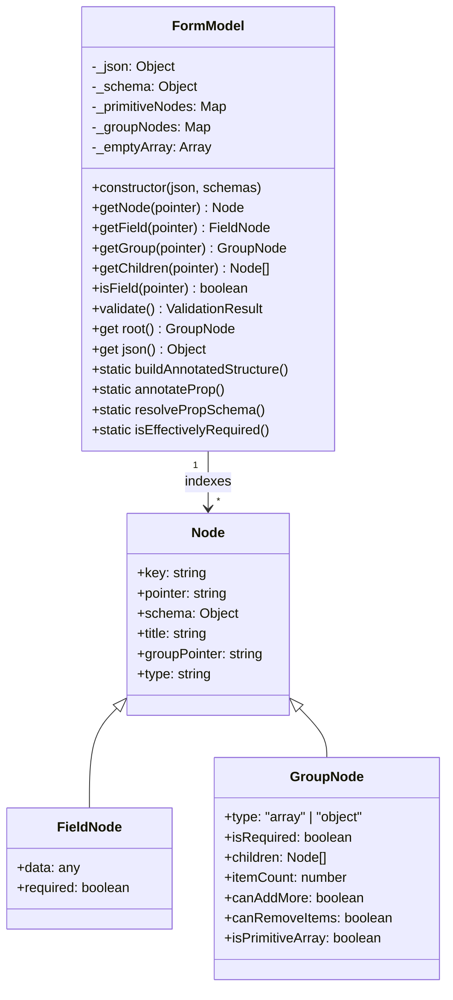

**Data Flow Strategy**:

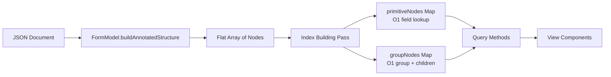

**Component**: `validation/validation-state.js` - `ValidationState` Class

**Responsibilities**:
- Store field errors and group error counts
- Map JSON Schema validation errors to field pointers
- Handle "required" field validation for empty values
- Provide query methods for error information
- Immutable state pattern

**Validation Flow**:

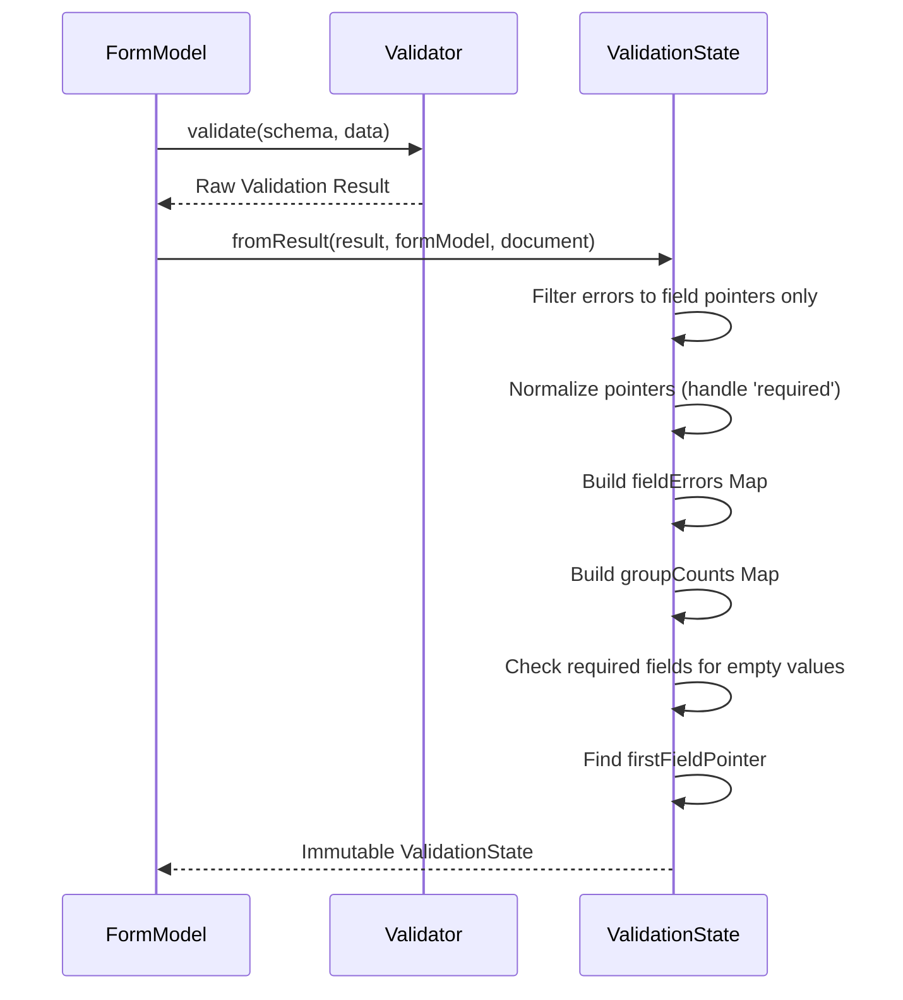

### 3. Controller Layer (Reactive Controllers)

Controllers implement the **Reactive Controller** pattern from Lit, providing cross-cutting concerns without polluting component logic.

**Key Controllers**:

| Controller | Purpose | Listens To | Dispatches | State |
|------------|---------|------------|------------|-------|
| `ActiveStateController` | Track currently active section and manage indicator | `EVENT_ACTIVE_STATE_CHANGE`, `EVENT_FOCUS_ELEMENT` | - | `pointer` |
| `ScrollCoordinatorController` | Sync scrolling between panels | `EVENT_FOCUS_ELEMENT` | `EVENT_EDITOR_SCROLL_TO`, `EVENT_NAVIGATION_SCROLL_TO` | `_coordinating` |
| `ElementRegistryController` | Map pointers to DOM elements | - | - | Registry Map |
| `ScrollTargetController` | Scroll to target when requested | Custom scroll events | - | - |

**Controller Coordination**:

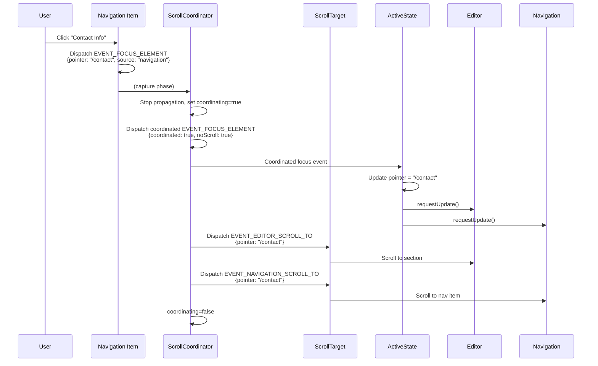

### 4. View Layer (Dumb Presentation Components)

**Key Principle**: Views receive ALL computed data via props. Zero business logic.

**Main View Components**:

1. **`views/editor.js` - EditorView**
   - Receives: `formModel`, `validationState`, `activePointer`
   - Renders: Form fields, groups, breadcrumbs
   - Emits: `form-model-intent` events (value changes, array ops)
   - Pre-computes: Field props cache (`_fieldPropsMap`) in `willUpdate()`

2. **`views/navigation.js` - NavigationView**
   - Receives: `formModel`, `validationState`, `activePointer`
   - Renders: Tree structure, error badges, action menus
   - Emits: `form-model-intent` events (array ops)
   - Pre-computes: Navigation tree in `willUpdate()`

3. **`views/components/editor/generic-field/generic-field.js` - GenericField**
   - Receives: `type`, `label`, `value`, `error`, `required`, `options`
   - Renders: Appropriate input component (text, number, checkbox, select, textarea)
   - Emits: `value-change` events
   - **100% domain-agnostic** - knows nothing about forms, schemas, or pointers

**Dumb Component Example**:

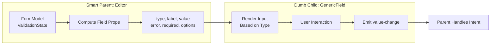

**Pre-Computation Strategy** (Avoiding N² renders)

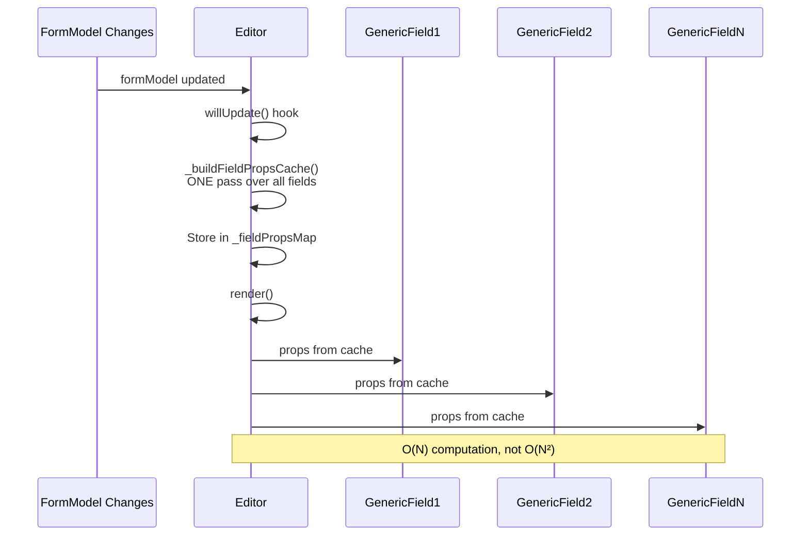

**The Problem**: Without pre-computation, each field would compute its props (type, label, error, options) on every render. For 100 fields, that's 500 operations per render.

**The Solution**: 
1. In `willUpdate()`: Loop through ALL fields once, compute all props, store in Map
2. In `render()`: Each field does O(1) Map lookup - no computation

**Why it matters**: Lit may re-render multiple times (user typing, active state changes, etc.). Pre-computed props mean renders stay fast.

### 5. Utility Layer (Pure Functions)

**Categories**:

| Category | Files | Exports | Purpose |
|----------|-------|---------|---------|
| **Schema** | `schema.js` | `getSchema`, `resolvePropSchema` | Load and resolve $ref references |
| **Pointer** | `rfc6901-pointer.js`, `pointer-utils.js` | `get`, `append`, `splitPointer`, `parseArrayItemPointer` | RFC 6901 JSON Pointer operations |
| **Patch** | `rfc6902-patch.js` | `applyOp` | RFC 6902 JSON Patch operations |
| **Validation** | `validation-helper.js` | `getFieldError`, `getGroupErrorCount` | Query validation state |
| **Navigation** | `navigation-helper.js`, `navigation-tree-builder.js` | `navigateToPointer`, `buildNavigationTree` | Navigation logic |
| **Field** | `field-helper.js` | `determineFieldType`, `getEnumOptions` | Field type detection |
| **Data Generation** | `data-generator.js` | `generateMinimalDataForSchema`, `generateArrayItem` | Create default values from schema |
| **Focus** | `focus-helper.js` | `focusElement` | Focus management |
| **Breadcrumb** | `breadcrumb-helper.js` | `buildBreadcrumbSegments` | Breadcrumb path calculation |

**Key Point**: All utilities are PURE functions. No side effects, no state.

## Data Flow Patterns

### Intent-Based Updates (Unidirectional Flow)

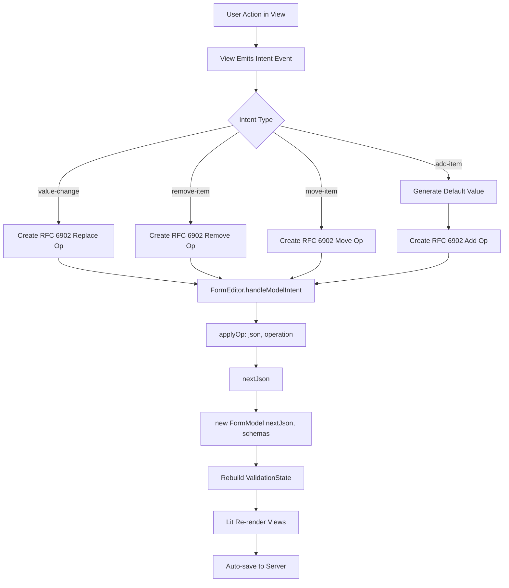

**Operation Structure**:

All user intents are normalized to RFC 6902 operations:

- **Replace operation**: Changes field value (op: 'replace', path, value)
- **Add operation**: Adds array item (op: 'add', path, value)
- **Remove operation**: Removes array item (op: 'remove', path)
- **Move operation**: Reorders array items (op: 'move', path, to) - 'to' is target pointer

### Focus Management Flow

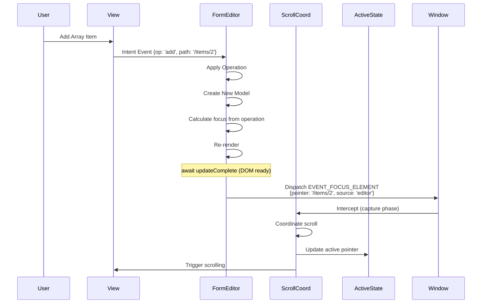

### Scroll Synchronization Flow

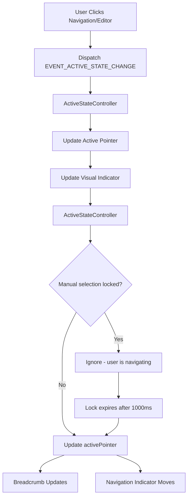

## Schema-Driven Strategy

### Why Schema-First?

1. **Single Source of Truth**: Schema defines structure, validation, labels, types
2. **Validation Built-In**: JSON Schema validators provide robust validation
3. **Extensibility**: New field types via schema properties (semantic types, UI hints)
4. **Maintainability**: Form structure separate from code
5. **Reusability**: Same schema for forms, API validation, documentation

### Schema Resolution

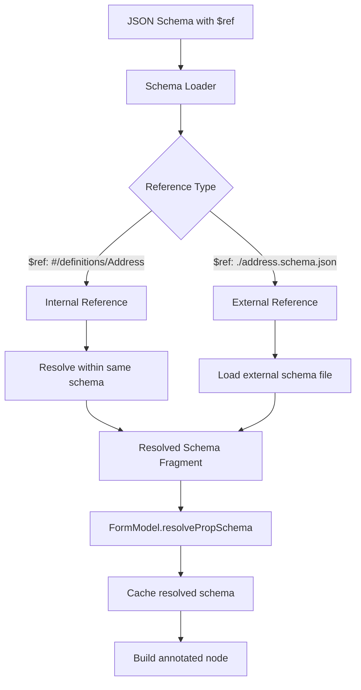

### Derived Properties Pattern

The FormModel calculates derived properties ONCE during construction:

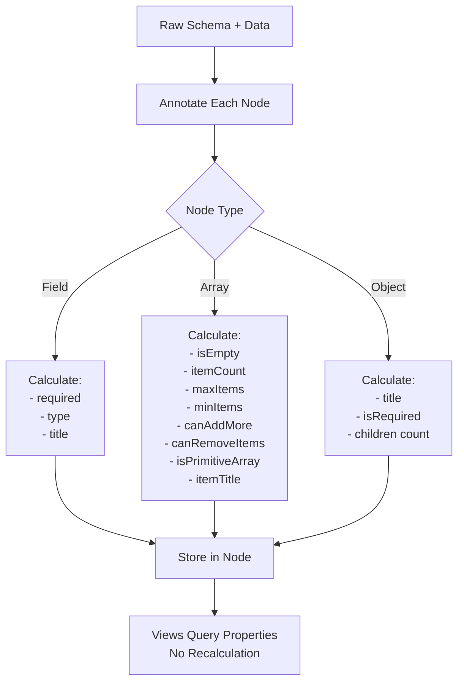

## Design Patterns & Best Practices

### 1. Immutable Data Pattern

**Problem**: Tracking what changed, preventing stale references  
**Solution**: Every update creates a new FormModel instance

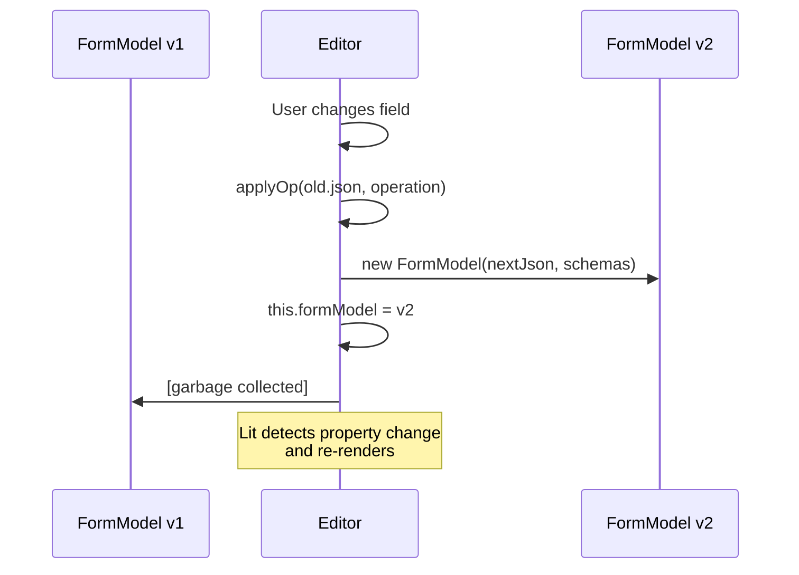

### 2. Pre-Computation Cache Pattern

**Problem**: Computing same values for each field on every render  
**Solution**: Compute all derived props in `willUpdate()`, cache in Map

Benefits:
- O(N) computation instead of O(N²)
- Separates computation from rendering
- Easier to test and debug

### 3. Controller Pattern (Reactive Controllers)

**Problem**: Cross-cutting concerns (scroll sync, focus management)  
**Solution**: Lit Reactive Controllers that hook into component lifecycle

Benefits:
- Keeps component logic focused
- Reusable across components
- Easy to test in isolation
- No inheritance needed

### 4. Event-Driven Architecture

**Problem**: Tight coupling between components  
**Solution**: Custom events for all interactions, coordinator intercepts

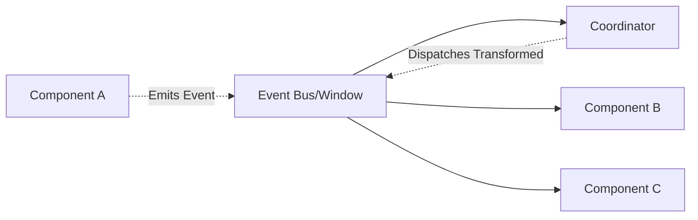

### 5. Registry Pattern for DOM References

**Problem**: Finding DOM elements by pointer efficiently  
**Solution**: ElementRegistryController maintains pointer → element Map

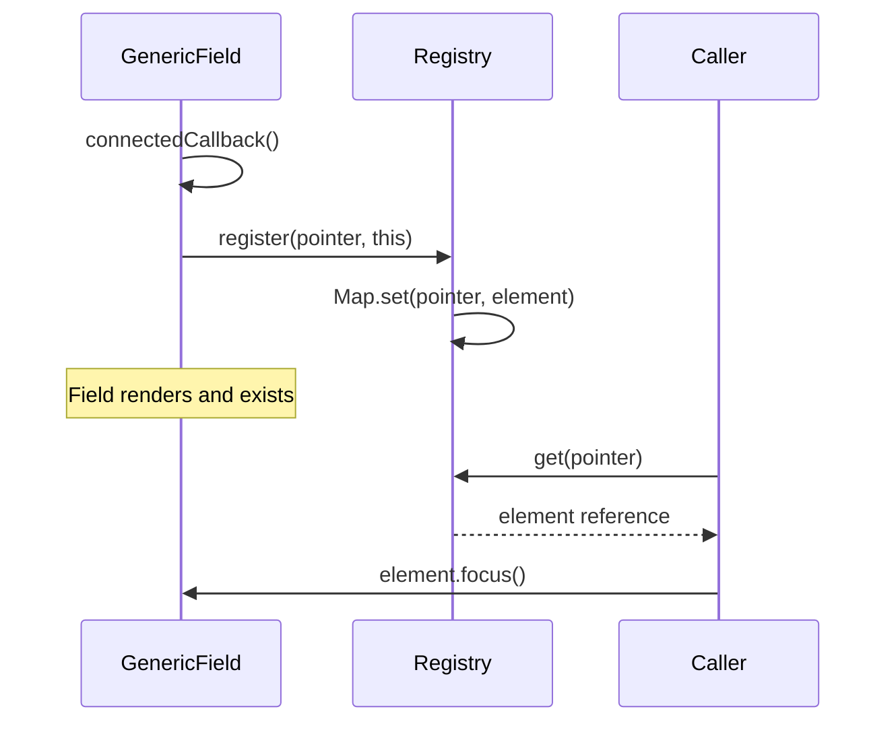

### 6. Dumb Component Pattern

**Problem**: Complex logic in presentation components, hard to test  
**Solution**: Smart containers compute everything, dumb components just render

**Dumb Component Checklist**:
- ✅ Only receives data via props
- ✅ No data fetching or business logic
- ✅ Only emits generic events (value-change, click)
- ✅ Doesn't know about FormModel, pointers, or schemas
- ✅ Can be tested in isolation with mock props
- ✅ Reusable in other contexts

### 7. JSON Pointer Pattern (RFC 6901)

**Problem**: Referencing nested data uniformly  
**Solution**: RFC 6901 JSON Pointers as identifiers

Examples:
- Root: `""`
- Top-level field: `"/email"`
- Nested: `"/address/street"`
- Array item: `"/items/0"`
- Deep nested: `"/items/2/variants/1/price"`

Benefits:
- Unambiguous references
- Supports arrays and objects uniformly
- Standard format (RFC 6901)
- Works with JSON Schema validation

### 8. RFC 6902 Patch Pattern

**Problem**: Describing data changes consistently  
**Solution**: RFC 6902 JSON Patch operations

Benefits:
- Standard format
- Atomic operations
- Transport-friendly (can sync over network)

## Performance Optimizations

### 1. O(1) Lookups via Map Indexes

FormModel uses Map data structures for instant lookups:
- **Slow approach**: `array.find()` - O(N) linear search
- **Fast approach**: `Map.get()` - O(1) hash lookup
- Maps built once during FormModel construction
- All subsequent queries are instant

### 2. Shared References (No Data Duplication)

The `primitiveNodes` and `groupNodes` Maps reference the SAME node objects, not copies.
- One node object in memory
- Multiple Maps hold references to it
- No data duplication
- Memory efficient

### 3. Debounced Input & Auto-Save

**GenericField** debounces rapid typing:
- Timer cleared on each keystroke
- Waits 300ms after typing stops
- Then emits value-change event

**FormEditor** auto-saves:
- Calls `saveJson()` after each model update
- `persist.js` adds additional debouncing at network layer
- Prevents excessive server requests

### 4. Efficient Re-Rendering

- Lit only re-renders changed properties
- Pre-computed caches avoid recalculation
- Shared state (activePointer) in controller, not duplicated

## Testing Strategy

The form block architecture is designed to be testable at multiple levels:

### Recommended Unit Test Coverage

| Layer | What to Test |
|-------|-------------|
| **FormModel** | Annotation, lookups, validation logic |
| **ValidationState** | Error mapping, required field handling |
| **Utilities** | Pure function logic, RFC operations |
| **Controllers** | State transitions, event handling |
| **Components** | Rendering, event emission |

### Integration Testing

Test the interaction between:
- Schema → Model → View pipeline
- User actions → Operations → Model updates
- Validation → Error display → Navigation

### E2E Testing

Test complete user workflows:
- Form completion and submission
- Error correction flows
- Array manipulation
- Navigation patterns

**Note**: Test files not yet implemented for this block.

## Key Takeaways

### What Makes This Complex?

1. **Coordination**: Multiple panels staying in sync (scroll, focus, active state)
2. **Validation**: Real-time validation with error mapping
3. **Nested Arrays**: Dynamic UI for unlimited nesting depth
4. **Focus Management**: Auto-focus after operations, manual vs automatic
5. **Performance**: O(1) lookups, efficient re-renders for large forms

### What Keeps It Maintainable?

1. **Clear Separation**: Data → Controllers → Views → Components
2. **Immutable Model**: No hidden mutations, predictable updates
3. **Dumb Components**: Easy to test, reusable, no business logic
4. **Event-Driven**: Loose coupling via custom events
5. **Schema-Driven**: Structure separate from code
6. **Pure Utilities**: Testable, composable helper functions
7. **Standard Patterns**: RFC 6901 pointers, RFC 6902 patches

### Simplification Opportunities

1. **✅ DONE: Simplified Focus Management**: Removed post-update actions controller, use direct `updateComplete` in form.js
2. **✅ DONE: Unified Active State**: Simplified to event-driven state (no automatic scroll detection - only explicit user actions)
3. **Flatten Event Architecture**: Consider direct prop callbacks instead of event bubbling
4. **Reduce View Splitting**: Combine editor and navigation into single component (if needed)
5. **Simpler Active State**: Remove intersection observer, use click-only tracking
6. **Remove Pre-Computation**: Compute on-demand with useMemo-like caching
7. **Inline Utilities**: Move small helpers directly into components

Each simplification has trade-offs (performance, features, testability).
